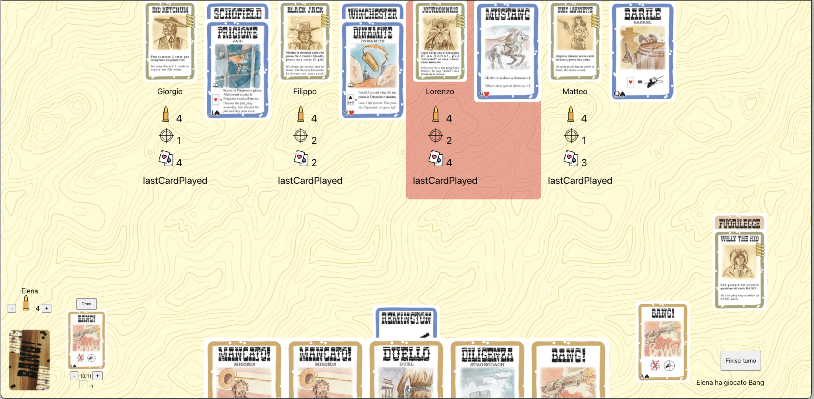

# Bang! Online

Porting online del famoso gioco di carte italiano

Puoi giocarci a questo indirizzo: [Bang!](https://bangonlinecard.web.app/)
- - -

### Utilizzo 
Il gioco e' ancora a una fase iniziale di sviluppo, quindi e' possibile che si presentino bug che non consentano il proseguimento del gioco.
E' consigliato provarlo parallelamente a una videochiamata coi giocatori presenti nella stanza, per commentare le proprie azioni nel caso non siano chiare dalla semplice interfaccia di gioco.

### Gioco
Appena entrati sul sito ci si trovera' di fronte a una schermata di login, nella quale immettere il nome con cui si vuole essere riconosciuti all'interno della partita e la stanza nella quale si vuole entrare.
Il meccanismo di creazione stanze e' ancora praticamente non implementato quindi se si inserisce il nome di una stanza che ancora non esiste si creera' questa stanza, altrimenti si entra nella sala d'attesa della stanza esistente.
Il primo a entrare in una stanza diventa l'admin, quindi sara' responsabile di fare iniziare il gioco una volta che tutti i partecipanti avranno scelto il loro cowboy.
Una volta iniziata la partita, si procede come da regolamento, effettuando manualmente molte delle operazioni, come ad esempio pescare e togliersi le vite quando si viene feriti.

